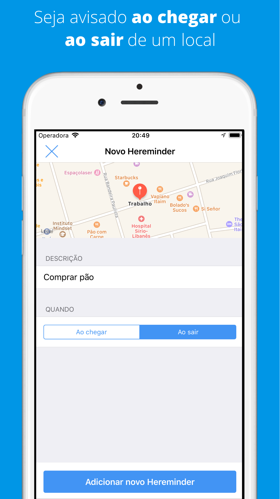

# Hereminders - iOS 

O Hereminders é um app de lembretes geolocalizados, implementado em Swift com arquitetura MVVM-C.

# Funcionalidades

- Linguagem: Swift 5
- Arquitetura: MVVM-C
- Integração com MapKit
- Suporte a 3 idiomas (Português, Inglês e Espanhol)
- Today Widget para adicionar lembretes
- Quick Actions para adicionar lembretes
- CoreData para persistência local de lembretes
- SwiftGen para imagens e strings localizadas
- Fastlane para gestão de provisioning profiles e publicação de versões beta

# Iniciando os trabalhos

1. Clone esse repositório 
2. Instale o [CocoaPods](https://guides.cocoapods.org/using/getting-started.html)
3. Rode `pod install` para instalar as dependências do projeto
4. Faça um build e rode o projeto ▶️

# Pessoas Contribuidoras

- Rodrigo Borges - [GitHub](https://github.com/rdgborges) / [Twitter](https://twitter.com/rdgborges)
- Alexandre Cardoso - [GitHub](https://github.com/AlexandreBCardoso) / [LinkedIn](https://www.linkedin.com/in/alexandre-barbosa-cardoso-a02a3a173/)
- Dairan Temoteo - [GitHub](http://github.com/dairan) / [LinkedIn](https://www.linkedin.com/in/dairan/)
- Gabriela Sillis - [GitHub](https://github.com/gsillis) / [LinkedIn](https://www.linkedin.com/in/gabrielasillis/)
- Diego Janjardi Briz Llopis - [GitHub](https://github.com/diegollopis) / [LinkedIn](https://www.linkedin.com/in/diego-llopis36/)
- Sara Felix - [GitHub](https://github.com/sarafelix25) / [LinkedIn](https://www.linkedin.com/in/sarabfelix/)

# Sobre a Devpass

A Devpass é uma comunidade de pessoas desenvolvedoras de alto potencial acelerando suas carreiras através de desenvolvimento de produtos reais, como o Hereminders, e conexões com as principais lideranças de tecnologia do país, através de mentorias particulares e Tech Talks.

Se interessou? Acesse www.devpass.com.br e se inscreva na nossa lista para ficar por dentro das novidades!
