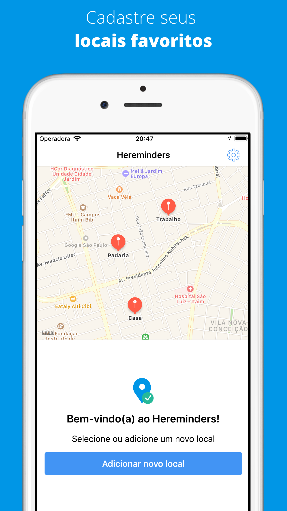
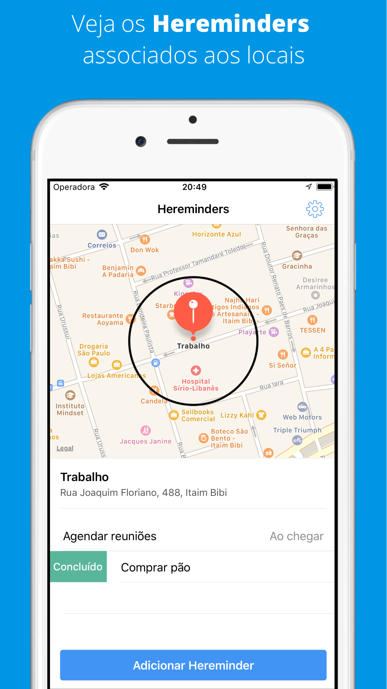

# Hereminders - iOS
O Hereminders é um app de lembretes geolocalizados, implementado em Swift com arquitetura MVVM-C.

# Pessoas Contribuidoras
- Rodrigo Borges - [GitHub](https://github.com/rdgborges) / [Twitter](https://twitter.com/rdgborges)

